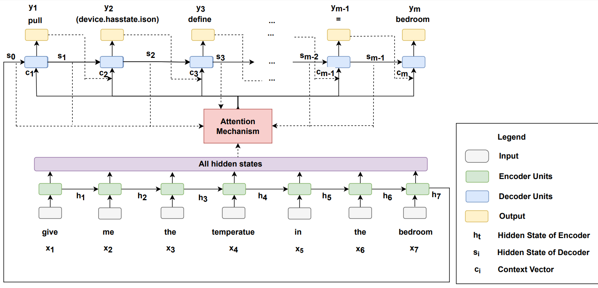

# Industry Engagement and Demonstrators Grant: IEDG
Conversational Natural Language Interface for Smart Homes

 

Smart homes are increasing in complexity and ability. Interacting with a smart home through natural language is increasingly important. The load is increasingly on the user to remember an increasingly large set of home assistant commands. This interaction can be improved by conversational systems that have a longer series of interactions with the user. The project will build a demonstration of a smart home which can be controlled by a natural language conversation system.

The demonstration will show a user interacting with a smart home with a series of very complex conversations. Such as asking “What is the temperature in the living room”.  The system will need to understand this question, discover IoT services, then compose context queries to be to understand the context. The system may then offer options for improving the room temperature.

To achieve this, there are a series of steps. These include, speech to text, text to CDQL. To implement this the student will need to create a GUI, use IoT technologies, NLP technologies, use ontologies, adapt existing middleware such as Dialogflow, and integrate with existing systems including CoaaS and Home Assistant. 

The following steps aim to deploy a user interface for smarthome.
## Install

Clone the repository.

`pip install -r requirements.txt`

**npm** is required to integrate the user interface. Depending on the operating system such as Windown, Linux, and Mac, the method to install **npm** can be found at the following link:

https://docs.npmjs.com/downloading-and-installing-node-js-and-npm

## Build a text to CDQL

The purpose of this section is to create a text-to-CDQL system.
 
### Data Generator

Data Generator aims to create the data to train and evaluate the model. You can directly download the pre-generated data from [here](https://github.com/parkerhuynh/IEDG/tree/main/text-to-CDQL/data). If you want to create by yourself, you can edit the templates into the file named `data_templates.py` in the folder named `text-to-CDQL`. After that, you run the following code to generate the dataset:

`python text-to-CDQL\data_generator.py`

### Training Model

The model is created based on the attetion encoder-decoder RNN artchitecture. Before trainning the model, you should set the parameters of your model such as the number of hidden units, epoches, and learning rate in the file `config.py` in the folder named `text-to-CDQL`. To train the model, run:

`python text-to-CDQL\training.py`

You can also load the pre-trained model from [here](https://github.com/parkerhuynh/IEDG/tree/main/text-to-CDQL/saved_model/translator).

## IoT Data Generator

IoT-data-simulator is the tool which allows you to simulate IoT devices data with great flexibility. With this tool you won't need to code another new simulator for each IoT project. You can setup and use this tool at the following link:

https://github.com/IBA-Group-IT/IoT-data-simulator

You can load the data schema by the file named `smarthome.json` in the folder named `IoT Schema Data Simulation`.

## User Interface

This section aims to integrate the user interface:

In the project directory, you can run:

`npm start`

After that, you run:

`python api/backend.py`

## References

### Context Definition and Query Language: Conceptual Specification, Implementation, and Evaluation

https://www.mdpi.com/1424-8220/19/6/1478

@article{Hassani2019ContextDA,
  title={Context Definition and Query Language: Conceptual Specification, Implementation, and Evaluation},
  author={Alireza Hassani and Alexey Medvedev and Pari Delir Haghighi and Sea Ling and Arkady B. Zaslavsky and Prem Prakash Jayaraman},
  journal={Sensors (Basel, Switzerland)},
  year={2019},
  volume={19}
}

### Neural Machine Translation by Jointly Learning to Align and Translate

https://arxiv.org/abs/1409.0473

@misc{bahdanau2016neural,
      title={Neural Machine Translation by Jointly Learning to Align and Translate}, 
      author={Dzmitry Bahdanau and Kyunghyun Cho and Yoshua Bengio},
      year={2016},
      eprint={1409.0473},
      archivePrefix={arXiv},
      primaryClass={cs.CL}
}

## References
* [parker.ngoc.huynh@gmail.com](parker.ngoc.huynh@gmail.com)
* [https://www.linkedin.com/in/parkerhuynh/](https://www.linkedin.com/in/parkerhuynh/)
